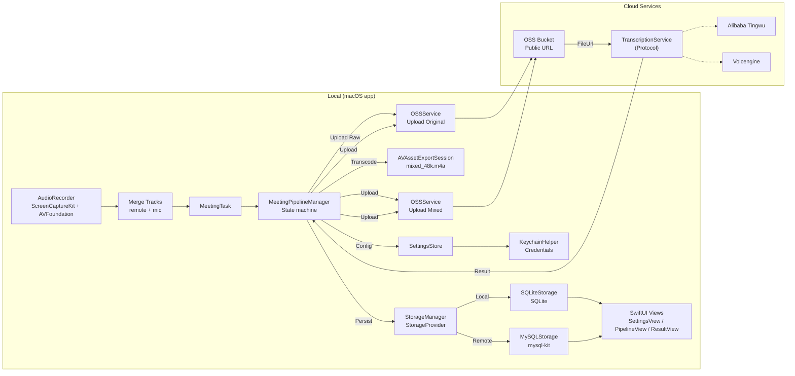

# VoiceMemo

A professional, high-fidelity audio recording utility for macOS, designed to capture real-time voice conversations from any application using the native **ScreenCaptureKit** and **AVFoundation** frameworks.

Read this in Chinese: [README_CN.md](README_CN.md)

## Features

- **Dual-Track Recording**: Simultaneously captures system audio (remote voice) and microphone input (local voice).
- **Automatic Merging**: Intelligently mixes both tracks into a single high-quality audio file post-recording.
- **Flexible App Selection**: Supports recording from any application, with intelligent filtering for seamless capture.
- **Native Performance**: Built with SwiftUI and ScreenCaptureKit for optimal performance and low CPU overhead.
- **Theme Mode**: System (Auto) / Light / Dark appearance selection in Settings.
- **Privacy-First**: Operates locally on your machine with clear permission handling.
- **Meeting Minutes (Multi-Provider ASR)**: Support for **Alibaba Cloud Tingwu** and **Volcengine** (ByteDance) to transcribe audio and generate structured minutes (summary, key points, action items), with Markdown export.
- **Storage Backends (SQLite/MySQL)**: Store history locally or in MySQL, with optional local-to-MySQL sync.

## Changelog

See [CHANGELOG.md](CHANGELOG.md) for full release history.

## Security and Audit

See [Security and Audit Notes](doc/09-security-and-audit.md).

## Requirements

- **OS**: macOS 13.0 (Ventura) or later.
- **Hardware**: Any Mac supporting macOS 13.0+.
- **Development**: Xcode 14.1+ for building and signing.

## Architecture



## Project Structure

- `Sources/`: Core Swift implementation.
- `Package.swift`: Swift Package Manager configuration.
- `package_app.sh`: Automated build and ad-hoc signing script.
- `Info.plist`: Application configuration and permission strings.

## Getting Started

### 1. Build and Run (recommended)

Due to macOS security requirements (ScreenCaptureKit needs specific entitlements and signing), we provide a convenience script for local execution:

```bash
chmod +x package_app.sh
./package_app.sh
open VoiceMemo.app
```

### 2. Permissions

When you first start recording, macOS will request the following permissions:
- **Screen Recording**: Required by ScreenCaptureKit to capture system/app audio.
- **Microphone**: Required to capture your own voice.

Please grant these permissions in **System Settings > Privacy & Security**.

### 3. Configure ASR Provider + OSS (optional)

Open Settings in the app and configure:

**General:**
- Theme: System (Auto) / Light / Dark
- OSS Configuration (Required for file hosting): Alibaba Cloud AccessKeyId / AccessKeySecret, bucket, region, prefix

**ASR Provider (Choose one):**
- **Alibaba Tingwu**: AppKey
- **Volcengine**: AppId, AccessToken, ResourceId (supports auto format inference)

### 4. Audio Outputs

Recorded audio files are saved to:

- `~/Downloads/VoiceMemoRecordings/`

Filenames:

- `recording-<timestamp>-remote.m4a`: Remote/system audio.
- `recording-<timestamp>-local.m4a`: Local microphone audio.
- `recording-<timestamp>-mixed.m4a`: Merged conversation (Mixed mode).

Imported audio files are copied into the app sandbox:

- `~/Library/Application Support/VoiceMemo/recordings/` (filename: `<uuid>.<ext>`)

### 5. Generate minutes

After a recording completes, the latest task appears in the pipeline UI. Trigger the steps manually:
- Transcode → Upload → Create Task → Refresh Status
- View Result → Export Markdown

### 6. Import audio (optional)

Use the sidebar action **Import Audio** to create a meeting task from an existing audio file, then run the same pipeline steps as above.

For detailed import instructions, please refer to the [Audio Import Guide](doc/08-import-guide.md).

## Development

To open the project in Xcode for debugging:

```bash
python3 generate_project.py
xed VoiceMemo.xcodeproj
```

Ensure you configure **Signing & Capabilities** with your Development Team to run the app with full permissions.

## Roadmap

### Completed
- [x] Dual-track recording (Remote + Local)
- [x] Automatic audio merging
- [x] Audio Import (Support for external files)
- [x] Multi-provider ASR architecture (Tingwu + Volcengine)
- [x] Alibaba Cloud Tingwu offline transcription + minutes generation
- [x] Volcengine ASR integration (V3 API)
- [x] OSS upload integration
- [x] Manual pipeline UI (transcode/upload/create/poll)
- [x] MySQL storage backend with local-to-remote sync
- [x] Unified error handling for ASR services

### Planned
- [ ] Speaker diarization (cloud-based)
- [ ] Real-time transcription UI
- [ ] Auto-pipeline execution (fully automated workflow)
- [ ] Multi-language support for minutes generation
- [ ] Advanced audio editing capabilities

## Contact

sherlock.yin1994@gmail.com

## License

[MIT License](LICENSE)
