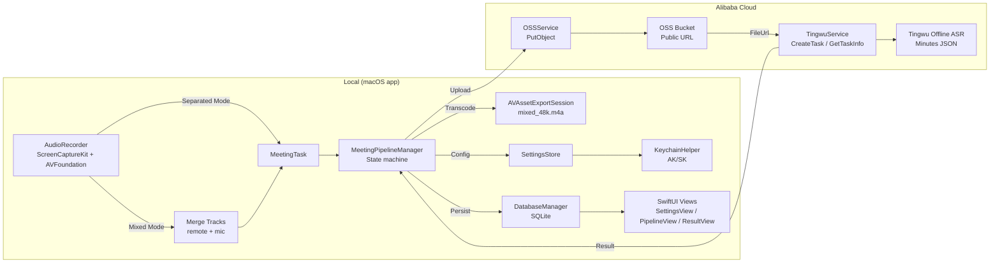

# VoiceMemo

A professional, high-fidelity audio recording utility for macOS, specifically designed to capture real-time WeChat voice conversations using the native **ScreenCaptureKit** and **AVFoundation** frameworks.

Read this in Chinese: [README_CN.md](README_CN.md)

## Features

- **Dual-Track Recording**: Simultaneously captures system audio (remote voice) and microphone input (local voice).
- **Automatic Merging**: Intelligently mixes both tracks into a single high-quality audio file post-recording.
- **Intelligent App Detection**: Automatically filters and prioritizes WeChat for seamless capture.
- **Native Performance**: Built with SwiftUI and ScreenCaptureKit for optimal performance and low CPU overhead.
- **Privacy-First**: Operates locally on your machine with clear permission handling.
- **Meeting Minutes (Alibaba Cloud Tingwu + OSS)**: Manual pipeline to transcribe audio and generate structured minutes (summary, key points, action items), with Markdown export.

## Changelog

See [CHANGELOG.md](CHANGELOG.md) for full release history.

## Recognition Modes

The app now supports two recognition modes to cater to different meeting scenarios:

- **Mixed Mode (Default)**: Combines all audio sources into a single track. This is suitable for general recordings and simpler transcription needs.
- **Dual-Speaker Separated Mode**: Specifically designed for 1-on-1 calls. It treats System Audio as Speaker 2 (Remote) and Microphone as Speaker 1 (Local). Each track is recognized independently, providing better speaker identification and alignment in the final minutes.

## Requirements

- **OS**: macOS 13.0 (Ventura) or later.
- **Hardware**: Any Mac supporting macOS 13.0+.
- **Development**: Xcode 14.1+ for building and signing.

## Architecture



## Project Structure

- `Sources/`: Core Swift implementation.
- `Package.swift`: Swift Package Manager configuration.
- `package_app.sh`: Automated build and ad-hoc signing script.
- `Info.plist`: Application configuration and permission strings.

## Getting Started

### 1. Build and Run (recommended)

Due to macOS security requirements (ScreenCaptureKit needs specific entitlements and signing), we provide a convenience script for local execution:

```bash
chmod +x package_app.sh
./package_app.sh
open VoiceMemo.app
```

### 2. Permissions

When you first start recording, macOS will request the following permissions:
- **Screen Recording**: Required by ScreenCaptureKit to capture system/app audio.
- **Microphone**: Required to capture your own voice.

Please grant these permissions in **System Settings > Privacy & Security**.

### 3. Configure Tingwu + OSS (optional)

Open Settings in the app and configure:
- Alibaba Cloud AccessKeyId / AccessKeySecret (stored in Keychain)
- Tingwu AppKey
- OSS bucket / region / prefix

### 4. Audio Outputs

Raw recordings are saved to your `Downloads` directory:

- `remote_[timestamp]_[id].m4a`: The other person's voice.
- `local_[timestamp]_[id].m4a`: Your voice.
- `mixed_[timestamp]_[id].m4a`: The merged conversation.

### 5. Generate minutes

After a recording completes, the latest task appears in the pipeline UI. Trigger the steps manually:
- Transcode → Upload → Create Task → Refresh Status
- View Result → Export Markdown

## Development

To open the project in Xcode for debugging:

```bash
xed .
```

Ensure you configure **Signing & Capabilities** with your Development Team to run the app with full permissions.

## Roadmap

- [x] Dual-track recording (Remote + Local)
- [x] Automatic audio merging
- [x] Alibaba Cloud Tingwu offline transcription + minutes generation
- [x] OSS upload integration
- [x] Manual pipeline UI (transcode/upload/create/poll)
- [ ] Speaker diarization (cloud-based)
- [ ] Real-time transcription UI

## Contact

sherlock.yin1994@gmail.com

## License

[MIT License](LICENSE)
