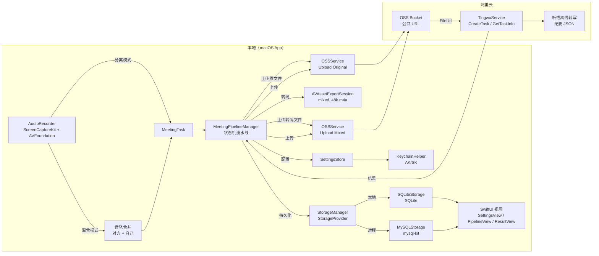

# VoiceMemo

一款专业、高保真的 macOS 音频录制工具，专为捕获微信实时语音通话设计。基于 macOS 原生的 **ScreenCaptureKit** 和 **AVFoundation** 框架构建。

English version: [README.md](README.md)

## 功能特性

- **双轨录制**：同时捕获系统音频（对方声音）和麦克风输入（自己的声音）。
- **自动合成**：录音结束后，智能地将两个轨道合并为一个高质量的混音文件。
- **智能应用检测**：自动过滤并优先识别微信应用，实现无缝捕获。
- **原生性能**：采用 SwiftUI 和 ScreenCaptureKit 开发，性能卓越，CPU 占用率极低。
- **隐私优先**：所有处理均在本地完成，具有清晰的权限管理机制。
- **会议纪要（阿里云听悟 + OSS）**：手动触发流水线进行转写和结构化纪要生成（摘要 / 要点 / 待办），并支持导出 Markdown。
- **存储（SQLite/MySQL）**：历史记录可保存到本地或 MySQL，并支持本地同步到 MySQL。

## 更新日志

请参阅 [CHANGELOG.md](CHANGELOG.md) 查看完整的发布历史。

## 识别模式

应用现在支持两种识别模式，以适应不同的会议场景：

- **混合模式 (默认)**：将所有音频源合并为单个音轨。适用于普通录音和简单的转写需求。
- **双人分离模式**：专为 1-on-1 通话设计。系统音频被视为 Speaker 2（远端），麦克风被视为 Speaker 1（本地）。两个音轨将独立进行识别，在最终的纪要中提供更好的说话人识别和对话对齐。

## 环境要求

- **操作系统**：macOS 13.0 (Ventura) 或更高版本。
- **硬件**：任何支持 macOS 13.0+ 的 Mac 设备。
- **开发工具**：Xcode 14.1+（用于编译和签名）。

## 技术架构



## 项目结构

- `Sources/`：核心 Swift 代码实现。
- `Package.swift`：Swift Package Manager 项目配置。
- `package_app.sh`：自动化编译及 Ad-hoc 签名脚本。
- `Info.plist`：应用配置及权限描述。

## 快速开始

### 1. 编译与运行（推荐）

由于 macOS 的安全机制（ScreenCaptureKit 需要特定的权限和签名），我们提供了一个便捷脚本用于本地执行：

```bash
chmod +x package_app.sh
./package_app.sh
open VoiceMemo.app
```

### 2. 权限说明

首次开始录制时，macOS 会请求以下权限：
- **屏幕录制**：ScreenCaptureKit 捕获系统/应用音频所需。
- **麦克风**：捕获您自己声音所需。

请在 **系统设置 > 隐私与安全性** 中授予这些权限。

### 3. 配置听悟 + OSS（可选）

在应用内打开 Settings 并配置：
- 阿里云 AccessKeyId / AccessKeySecret（保存到 Keychain）
- 听悟 AppKey
- OSS bucket / region / prefix

### 4. 音频输出

录制输出将保存至：

- `~/Downloads/VoiceMemoRecordings/`

文件命名规则：

- `recording-<timestamp>-remote.m4a`：系统/远端音频（对方声音）。
- `recording-<timestamp>-local.m4a`：麦克风/本地音频（自己的声音）。
- `recording-<timestamp>-mixed.m4a`：合成后的对话内容（混合模式）。

导入音频会被拷贝到应用沙盒目录：

- `~/Library/Application Support/VoiceMemo/recordings/`（文件名：`<uuid>.<ext>`）

### 5. 生成会议纪要

录音完成后，界面会出现最新任务的流水线节点，按顺序手动触发：
- 转码 → 上传 → 创建任务 → 刷新状态
- 查看结果 → 导出 Markdown

### 6. 导入音频（可选）

使用左侧栏的 **Import Audio** 从已有音频文件创建任务，然后按上述相同步骤运行流水线。

有关导入模式（会议模式 vs 听写模式）的详细说明，请参阅 [音频导入指南](doc/08-import-guide.zh-CN.md)。

## 开发与调试

若要在 Xcode 中打开项目进行调试：

```bash
python3 generate_project.py
xed VoiceMemo.xcodeproj
```

请务必在 **Signing & Capabilities** 中配置您的开发团队（Team），以便应用能以完整权限运行。

## 开发路线图

- [x] 双轨录制 (对方 + 自己)
- [x] 自动音频合成
- [x] 音频导入 (支持外部文件)
- [x] 集成阿里云听悟离线转写 + 会议纪要生成
- [x] 集成 OSS 上传
- [x] 手动触发流水线 UI（转码/上传/创建/轮询）
- [ ] 说话人识别 (基于云端方案)
- [ ] 实时转写 UI 界面

## 联系方式

sherlock.yin1994@gmail.com

## 开源协议

[MIT License](LICENSE)
