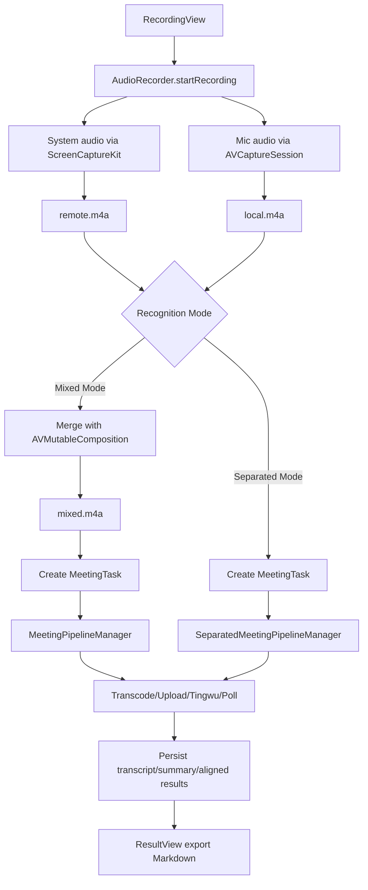

# Architecture Overview

## Purpose

This document explains how the app is structured end-to-end: UI, recording, pipeline, storage, and cloud integrations.

## Scope / Non-goals

- Scope: macOS app runtime flow from recording to Tingwu results.
- Non-goals: Alibaba Cloud service-side behavior details.

## Key Directories

- `Sources/VoiceMemo/`
  - `VoiceMemoApp.swift`: app entry and AppDelegate activation policy.
  - `ContentView.swift`: app shell, navigation, and state wiring.
  - `AudioRecorder.swift`: dual-track audio capture and local merge (supports both mixed and separated modes).
  - `Models/MeetingTask.swift`: persisted task model and status state machine.
  - `Services/`
    - `SettingsStore.swift`: user configuration, feature toggles, logging.
    - `KeychainHelper.swift`: secret storage (RAM AK/Secret) in Keychain.
    - `OSSService.swift`: upload audio to OSS.
    - `TingwuService.swift`: create Tingwu offline task + poll task info.
    - `MeetingPipelineManager.swift`: mixed mode pipeline (orchestrates transcode/upload/create/poll and persistence).
    - `SeparatedMeetingPipelineManager.swift`: separated mode pipeline (independent processing of dual tracks and alignment).
    - `DatabaseManager.swift`: SQLite persistence for task history.
    - `HistoryStore.swift`: observable wrapper for history list.
  - `Views/`: SwiftUI screens (recording, pipeline, results, settings, history).

## Runtime Components

- UI layer (SwiftUI)
  - `ContentView` builds a `NavigationSplitView` with:
    - Sidebar: `HistoryView` + "New Recording"
    - Detail: `RecordingView` or `ResultView` depending on selection
  - `RecordingView` embeds `PipelineView` for the latest task.
- Domain model
  - `MeetingTask` represents a recording + cloud task lifecycle.
- Storage
  - SQLite database stores tasks across app launches (`DatabaseManager`).
- Cloud integrations
  - OSS for file hosting, Tingwu for transcription/summarization.

## High-level Flow

## Status State Machine

Defined in `Models/MeetingTask.swift`:

- `recorded`: merged audio saved, task created locally
- `transcoding` → `transcoded`
- `uploading` → `uploaded`
- `created`: used as a transient “creating task” state in pipeline manager
- `polling` → `completed`
- `failed`: any step error

## External Dependencies

Declared in `Package.swift`:

- `ScreenCaptureKit` + `AVFoundation`: audio capture and export.
- `SQLite.swift`: local persistence.
- `alibabacloud-oss-swift-sdk-v2`: OSS uploads.
- `CryptoKit`: Tingwu request signing (ACS3-HMAC-SHA256).

