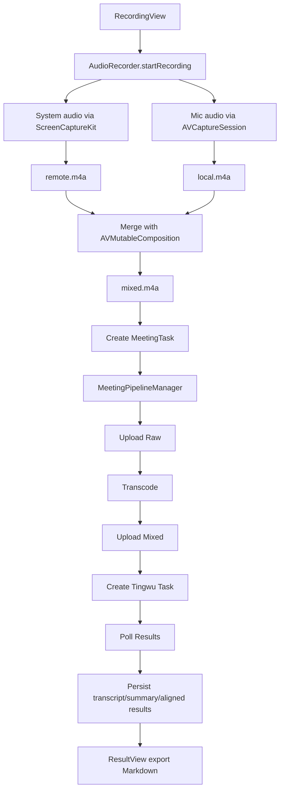

# Architecture Overview

## Purpose

This document explains how the app is structured end-to-end: UI, recording, pipeline, storage, and cloud integrations.

## Scope / Non-goals

- Scope: macOS app runtime flow from recording to Tingwu results.
- Non-goals: Alibaba Cloud service-side behavior details.

## Key Directories

- `Sources/VoiceMemo/`
  - `VoiceMemoApp.swift`: app entry and AppDelegate activation policy.
  - `ContentView.swift`: app shell, navigation, and state wiring.
  - `AudioRecorder.swift`: dual-track audio capture and local merge.
  - `Models/MeetingTask.swift`: persisted task model and status state machine.
  - `Services/`
    - `SettingsStore.swift`: user configuration, theme, feature toggles, logging.
    - `KeychainHelper.swift`: secret storage (RAM AK/Secret) in Keychain.
    - `OSSService.swift`: upload audio to OSS.
    - `TingwuService.swift`: create Tingwu offline task + poll task info.
    - `MeetingPipelineManager.swift`: pipeline manager (orchestrates transcode/upload/create/poll and persistence).
    - `Pipeline/`
      - `PipelineBoard.swift`: in-memory execution board (blackboard) for node state.
      - `PipelineNodes.swift`: pipeline node implementations (Upload, Transcode, CreateTask, Polling).
      - `TranscriptParser.swift`: transcript parsing utilities for Tingwu results.
    - `Storage/StorageProvider.swift`: storage abstraction used by the pipeline.
    - `Storage/SQLiteStorage.swift`: local SQLite persistence for task history.
    - `Storage/MySQLStorage.swift`: MySQL persistence for task history.
    - `Storage/StorageManager.swift`: switches providers based on settings and supports sync.
    - `HistoryStore.swift`: observable wrapper for history list.
  - `Views/`: SwiftUI screens (recording, pipeline, results, settings, history).

## Runtime Components

- UI layer (SwiftUI)
  - `ContentView` builds a `NavigationSplitView` with:
    - Sidebar: `HistoryView` (Search, Import Audio, New Recording, task history)
    - Detail: `RecordingView` or `ResultView` depending on selection
  - `RecordingView` embeds `PipelineView` for the latest task.
- Domain model
  - `MeetingTask` represents a recording + cloud task lifecycle.
- Storage
  - Storage is abstracted by `StorageProvider` and selected by `StorageManager` (SQLite by default, MySQL optional).
- Cloud integrations
  - OSS for file hosting, Tingwu for transcription/summarization.

## High-level Flow

## Status State Machine

Defined in `Models/MeetingTask.swift`:

- `recorded`: merged audio saved, task created locally
- `uploadingRaw` → `uploadedRaw`: upload original high-fidelity audio to OSS (backup)
- `transcoding` → `transcoded`: transcode to 48kHz mixed audio
- `uploading` → `uploaded`: upload transcoded audio to OSS
- `created`: used as a transient "creating task" state in pipeline manager
- `polling` → `completed`: poll Tingwu task status and fetch results
- `failed`: any step error

## External Dependencies

Declared in `Package.swift`:

- `ScreenCaptureKit` + `AVFoundation`: audio capture and export.
- `SQLite.swift`: local persistence.
- `mysql-kit`: optional MySQL persistence.
- `alibabacloud-oss-swift-sdk-v2`: OSS uploads.
- `CryptoKit`: Tingwu request signing (ACS3-HMAC-SHA256).

## Security

Security considerations for data collection, storage, network egress, and secrets handling are documented in: `doc/09-security-and-audit.md`.

Key security aspects:

- Secrets (Alibaba Cloud AK/SK, MySQL password) are stored in Keychain, not UserDefaults.
- Audio data and meeting content are persisted locally and optionally uploaded to OSS.
- Screen Recording permission is required for system audio capture.
- Network traffic includes OSS uploads and Tingwu API calls.
