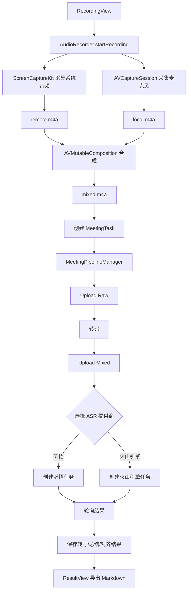

# 架构总览

## 文档目的

解释应用从 UI 到录音、流水线处理、数据持久化与云端集成的整体结构，方便后续迭代与排障。

## 范围 / 非目标

- 范围：macOS 端从录音到拿到听悟结果的完整链路。
- 非目标：阿里云服务端的内部实现细节。

## 目录结构

- `Sources/VoiceMemo/`
  - `VoiceMemoApp.swift`：应用入口与 AppDelegate（激活策略）。
  - `ContentView.swift`：应用骨架、导航与状态装配。
  - `AudioRecorder.swift`：双轨录音与本地合成（始终合成为 mixed.m4a）。
  - `Models/MeetingTask.swift`：任务模型与状态机。
  - `Services/`
    - `SettingsStore.swift`：配置、主题、功能开关、日志。
    - `KeychainHelper.swift`：Keychain 密钥存储（RAM AK/Secret）。
    - `OSSService.swift`：上传音频到 OSS。
    - `TranscriptionService.swift`：定义 ASR 提供商接口的协议。
    - `TingwuService.swift`：阿里云听悟实现（创建任务 + 查询）。
    - `VolcengineService.swift`：字节跳动火山引擎实现（创建任务 + 查询）。
    - `MeetingPipelineManager.swift`：流水线编排器（State Machine），负责调度具体的 PipelineNode。
    - `Pipeline/`
      - `PipelineBoard.swift`：流水线执行上下文（黑板），管理状态传递与执行上下文。
      - `PipelineNodes.swift`：具体的流水线节点实现（Upload, Transcode, CreateTask, Polling）。
      - `TranscriptParser.swift`：听悟转写结果解析器。
    - `Storage/StorageProvider.swift`：存储抽象接口。
    - `Storage/SQLiteStorage.swift`：本地 SQLite 任务持久化。
    - `Storage/MySQLStorage.swift`：MySQL 任务持久化。
    - `Storage/StorageManager.swift`：按配置切换存储实现，并支持同步。
    - `HistoryStore.swift`：历史列表的 Observable 包装。
  - `Views/`：SwiftUI 界面（录音、流水线、结果、设置、历史）。

## 运行时组件

- UI 层（SwiftUI）
  - `ContentView` 使用 `NavigationSplitView`：
    - 左侧：`HistoryView`（搜索、Import Audio、New Recording、任务历史列表）
    - 右侧：根据选择展示 `RecordingView` 或 `ResultView`
  - `RecordingView` 内嵌 `PipelineView` 展示最新任务的流水线操作。
- 领域模型
  - `MeetingTask` 表示一次录音及其云端处理生命周期。
- 存储
  - 存储通过 `StorageProvider` 抽象，并由 `StorageManager` 选择具体实现（默认 SQLite，可选 MySQL）。
- 云端
  - OSS 用于文件托管。
  - ASR 提供商：听悟（阿里云）和火山引擎（字节跳动）用于转写与总结。

## 高层流程

## 状态机

定义在 `Models/MeetingTask.swift`：

- `recorded`：本地合成完成并创建任务
- `uploadingRaw` → `uploadedRaw`：上传原始高保真音频到 OSS（备份）
- `transcoding` → `transcoded`：转码为 48kHz 混合音频
- `uploading` → `uploaded`：上传转码后的音频到 OSS
- `created`：流水线中用于"创建任务中"的临时状态
- `polling` → `completed`：轮询听悟任务状态并获取结果
- `failed`：任一步骤失败

## 依赖

在 `Package.swift` 中声明：

- `ScreenCaptureKit` + `AVFoundation`：音频采集与导出。
- `SQLite.swift`：本地持久化。
- `mysql-kit`：可选的 MySQL 持久化。
- `alibabacloud-oss-swift-sdk-v2`：OSS 上传。
- `CryptoKit`：听悟请求签名（ACS3-HMAC-SHA256）。
- 火山引擎无需外部 SDK：使用原生 URLSession 和基于 Header 的认证。

## 安全

关于数据收集、存储、网络流出和密钥处理的安全考虑，请参阅：`doc/09-security-and-audit.zh-CN.md`。

关键安全方面：

- 密钥（阿里云 AK/SK、火山引擎 Access Token、MySQL 密码）存储在 Keychain 中，而非 UserDefaults。
- 音频数据和会议内容在本地持久化，并可选择上传到 OSS。
- 系统音频采集需要屏幕录制权限。
- 网络流量包括 OSS 上传和 ASR API 调用（听悟或火山引擎）。
