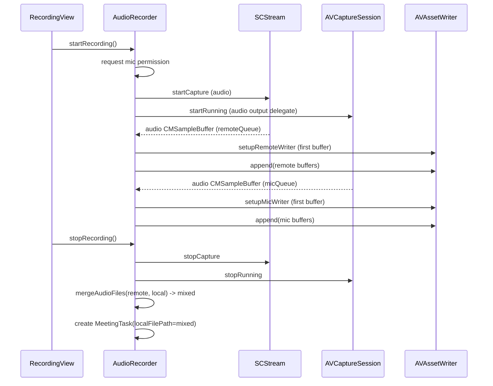

# Audio Capture and Merge

## Purpose

Describe how the app records “remote/system audio” and “local microphone audio”, and how it processes these files in different modes.

## Key Files

- `Sources/VoiceMemo/AudioRecorder.swift`
- `Sources/VoiceMemo/Models/MeetingTask.swift`
- `Sources/VoiceMemo/Info.plist` (usage descriptions)

## Recording Modes

The app records in **Mixed Mode**: Merges both audio tracks into a single `mixed.m4a` file after recording ends, for single-channel pipeline processing.

## Track Definitions

- Remote track: system audio captured by ScreenCaptureKit (`SCStream` audio output).
- Local track: microphone captured by `AVCaptureSession` and `AVCaptureAudioDataOutput`.

Both tracks are encoded as AAC in `.m4a` through `AVAssetWriter`.

## File Outputs and Paths

`AudioRecorder.beginRecordingSession` creates:

- Folder: `~/Downloads/VoiceMemoRecordings/`
- Filenames:
  - `recording-<timestamp>-remote.m4a`
  - `recording-<timestamp>-local.m4a`
  - `recording-<timestamp>-mixed.m4a` (on stop, via merge)

## Capture Flow

## Merge Strategy

`mergeAudioFiles(audio1:audio2:output:)`:

- Creates an `AVMutableComposition`.
- Attempts to load the first audio track from each input asset.
- Inserts both time ranges at `.zero` into separate composition tracks.
- Exports as `.m4a` using `AVAssetExportSession` preset `AVAssetExportPresetAppleM4A`.

Behavior notes:

- If one file has no valid audio track, it still exports using the other track.
- If both inputs have no valid audio tracks, it throws an error.

## Permissions

For ScreenCaptureKit audio capture:

- macOS requires Screen Recording permission for the app.
- Usage strings are in `Info.plist`:
  - `NSScreenCaptureUsageDescription`
  - `NSMicrophoneUsageDescription`

## Common Failure Modes

- Screen capture permission missing: SCK capture start errors; no remote track.
- Mic permission denied: local track missing; recording can still proceed depending on state.
- Writer setup fails: invalid stream description (sample rate or channels = 0).
- Export fails: composition export error; merge result not generated.
