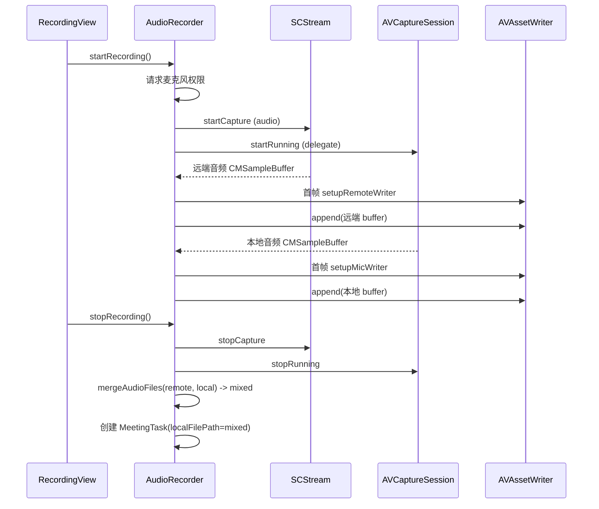

# 音频采集与合成

## 文档目的

说明应用如何同时录制“远端/系统音频”和“本地麦克风音频”，以及在不同模式下如何处理这些音频文件。

## 关键文件

- `Sources/VoiceMemo/AudioRecorder.swift`
- `Sources/VoiceMemo/Models/MeetingTask.swift`
- `Sources/VoiceMemo/Info.plist`（权限说明文案）

## 录制模式

应用默认使用 **混合模式 (Mixed)**：录音结束后将两路音频合成为一个 `mixed.m4a` 文件，供后续单路转写流水线使用。

## 双轨定义

- 远端轨：使用 ScreenCaptureKit（`SCStream`）采集系统音频（通常用于微信语音）。
- 本地轨：使用 `AVCaptureSession` + `AVCaptureAudioDataOutput` 采集麦克风。

两路音频均通过 `AVAssetWriter` 编码为 AAC（`.m4a`）。

## 输出文件与路径

`AudioRecorder.beginRecordingSession` 会创建：

- 目录：`~/Downloads/VoiceMemoRecordings/`
- 文件名：
  - `recording-<timestamp>-remote.m4a`
  - `recording-<timestamp>-local.m4a`
  - `recording-<timestamp>-mixed.m4a`（停止录音时合成）

## 采集流程

## 合成策略

`mergeAudioFiles(audio1:audio2:output:)`：

- 使用 `AVMutableComposition` 创建合成资源。
- 尝试分别读取两个输入音频的第一条 audio track。
- 将两条 track 从 `.zero` 开始并行插入到 composition 中。
- 使用 `AVAssetExportSession` + `AVAssetExportPresetAppleM4A` 导出 `.m4a`。

行为说明：

- 若其中一个输入没有有效音轨，会尽量使用另一个输入导出。
- 若两个输入都没有有效音轨，会抛出错误。

## 权限

ScreenCaptureKit 采集系统音频需要：

- 系统设置中授予应用“屏幕录制”权限。
- `Info.plist` 中包含：
  - `NSScreenCaptureUsageDescription`
  - `NSMicrophoneUsageDescription`

## 常见故障

- 未授予屏幕录制权限：SCK 启动报错，远端轨为空。
- 麦克风权限拒绝：本地轨为空；具体表现取决于运行时状态。
- 写入器初始化失败：音频格式描述异常（采样率/声道为 0）。
- 导出失败：合成导出报错，无法生成 mixed 文件。
