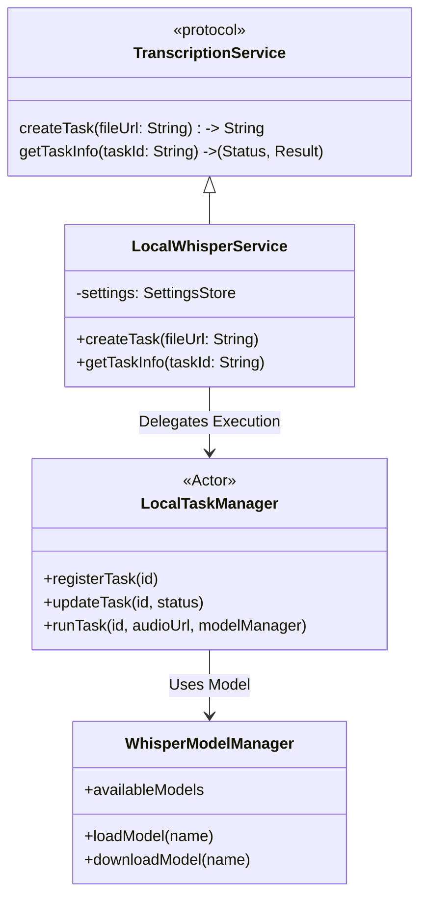

# Local Whisper Integration

## Overview

This document details the integration of **Local Whisper ASR** into the VoiceMemo application. This feature allows users to perform speech-to-text transcription completely offline using their device's hardware (CPU/NPU) via the [WhisperKit](https://github.com/argmaxinc/WhisperKit) library. Additionally, we integrate **FluidAudio** for local Speaker Diarization capabilities.

### Key Benefits

1.  **Privacy**: Audio data never leaves the device; no upload to cloud servers.
2.  **Cost**: Zero operational cost (no API usage fees).
3.  **Offline Capability**: Works without an internet connection (after initial model download).
4.  **Performance**: Optimized for Apple Silicon (M-series) using CoreML.

## Architecture

The integration leverages the existing `TranscriptionService` protocol to plug into the `MeetingPipelineManager` seamlessly.



### Components

1.  **`LocalWhisperService`**: Implements `TranscriptionService`. It acts as the bridge between the pipeline and the local inference engine.
2.  **`LocalTaskManager`**: An Actor that manages the state of asynchronous local tasks. Since local inference is not a REST API, this actor simulates "task creation" and "status polling" to maintain compatibility with the existing pipeline architecture.
3.  **`WhisperModelManager`**: Manages the lifecycle of Whisper models (downloading, loading into memory, deletion).
4.  **`WhisperKit`**: The underlying ASR engine that runs OpenAI's Whisper models converted to CoreML format.
5.  **`FluidAudio`**: The underlying Speaker Diarization engine that runs Pyannote models converted to CoreML format.

## Pipeline Integration

The `MeetingPipelineManager` orchestrates the flow. When `Settings.asrProvider` is set to `.localWhisper`, the pipeline adapts:

### Cloud Pipeline (Standard)
1.  **Record** -> `local.m4a`
2.  **Upload Raw** -> OSS (Backup)
3.  **Transcode** -> `mixed.m4a`
4.  **Upload Mixed** -> OSS
5.  **Create Task** -> Cloud API (Tingwu/Volcengine)
6.  **Poll Status** -> Cloud API

### Local Pipeline (Optimized)
1.  **Record** -> `local.m4a`
2.  **Upload Raw** -> *Skipped* (Optional backup, currently skipped)
3.  **Transcode** -> *Skipped* (WhisperKit handles various formats, or minimal transcoding)
4.  **Upload Mixed** -> *Skipped* (File is local)
5.  **Create Task** -> `LocalWhisperService` (Passes `file://` URL)
6.  **Poll Status** -> `LocalTaskManager` (Instant or in-memory check)

## Implementation Details

### Dependency

Added `WhisperKit` and `FluidAudio` to `Package.swift`:

```swift
dependencies: [
    .package(url: "https://github.com/argmaxinc/WhisperKit.git", from: "0.10.0"),
    .package(url: "https://github.com/FluidInference/FluidAudio.git", branch: "main") // Check for latest tag
]
```

### Service Factory

In `MeetingPipelineManager.swift`:

```swift
switch settings.asrProvider {
case .tingwu:
    self.transcriptionService = TingwuService(settings: settings)
case .volcengine:
    self.transcriptionService = VolcengineService(settings: settings)
case .localWhisper:
    self.transcriptionService = LocalWhisperService(settings: settings)
}
```

### Task Execution Flow (Result Fusion)

1.  `LocalWhisperService.createTask` receives a local file path.
2.  It generates a UUID `taskId` and registers it with `LocalTaskManager` as `.running`.
3.  It spawns a detached `Task` to run parallel inference:
    *   **Task A (ASR)**: Calls `WhisperKit.transcribe(audioPath:)` to get text segments.
    *   **Task B (Diarization)**: Calls `FluidAudio.diarize(audioPath:)` to get speaker time segments.
4.  **Result Fusion**:
    *   Iterates through each Transcript Segment.
    *   Calculates the time overlap (Intersection over Union) with all Speaker Segments.
    *   Assigns the Speaker ID with the maximum overlap to the Transcript Segment.
5.  On completion, updates `LocalTaskManager` state to `.success(result)`.
6.  The main pipeline polls `getTaskInfo` to retrieve the final JSON.

#### Result Fusion Algorithm Details

The fusion algorithm aligns ASR transcript segments with speaker diarization results. Several strategies are available:

| Strategy | Description | Pros | Cons |
|----------|-------------|------|------|
| **IoU (Intersection over Union)** | Calculates overlap ratio between segment union | Simple, intuitive | Penalizes long segments |
| **Time Overlap %** | Measures overlap duration relative to transcript length | Fair for varying lengths | Ignores segment boundaries |
| **Center Point Matching** | Matches based on segment center timestamps | O(1) per segment, fast | Less accurate for short words |
| **Dynamic Window (Recommended)** | Finds all overlapping speakers, picks longest overlap | Handles word boundaries well | More complex implementation |

**Recommended Implementation (Dynamic Window)**:

```swift
func assignSpeakerToTranscript(
    transcript: TranscriptSegment,
    speakers: [SpeakerSegment]
) -> String? {
    let windowStart = transcript.start
    let windowEnd = transcript.end
    
    let overlappingSpeakers = speakers.filter { speaker in
        speaker.start < windowEnd && speaker.end > windowStart
    }
    
    return overlappingSpeakers
        .map { ($0, min($0.end, windowEnd) - max($0.start, windowStart)) }
        .max(by: { $0.1 < $1.1 })?
        .0.speakerId
}
```

**Edge Cases**:
- No overlapping speakers: Assign "Unknown" or use nearest speaker
- Multiple speakers with equal overlap: Use speaker with earlier start time
- Very short segments (< 0.5s): Consider merging with adjacent segments

### Audio Preprocessing

While the document mentions that transcoding is "skipped", audio preprocessing is still necessary for optimal inference performance and accuracy.

#### Preprocessing Requirements

| Requirement | WhisperKit | FluidAudio | Action |
|-------------|------------|------------|--------|
| **Sample Rate** | 16kHz (recommended) | 16kHz | Resample if needed |
| **Channels** | Mono preferred | Mono | Convert to mono |
| **Format** | WAV/FLAC/M4A | WAV/FLAC | Convert if unsupported |
| **Duration** | Any (with chunking) | Any | Chunk long audio (>30min) |

#### Preprocessing Pipeline

```swift
func preprocessAudio(_ url: URL) async throws -> URL {
    let audioFile = try AVAudioFile(forReading: url)
    
    guard audioFile.fileFormat.sampleRate == 16000 else {
        return try await resampleAudio(url, to: 16000)
    }
    
    guard audioFile.fileFormat.channelCount == 1 else {
        return try await convertToMono(url)
    }
    
    if audioFile.duration > 1800 {
        return try await chunkAudio(url, maxDuration: 1800)
    }
    
    return url
}
```

#### Chunking Strategy for Long Audio

For audio files longer than 30 minutes, chunking is recommended to:

1. Reduce memory pressure during inference
2. Enable progressive result display
3. Allow cancellation mid-processing

```
Long Audio Chunking Flow
═══════════════════════════════════════════════════════════════

Input: 60-minute meeting recording
         │
         ▼
┌─────────────────────────────────────────────────────────────┐
│ Split into 30-minute chunks with 5-second overlap           │
│                                                              │
│  Chunk 1: 0:00 - 30:00  (overlap: 29:55 - 30:00)           │
│  Chunk 2: 29:55 - 59:55  (overlap: 59:50 - 59:55)          │
│  Chunk 3: 59:50 - 89:50  ...                                │
└─────────────────────────────────────────────────────────────┘
         │
         ▼
┌─────────────────────────────────────────────────────────────┐
│ Process chunks in parallel (limited by device cores)        │
└─────────────────────────────────────────────────────────────┘
         │
         ▼
┌─────────────────────────────────────────────────────────────┐
│ Merge results, deduplicate overlapping segments             │
└─────────────────────────────────────────────────────────────┘
```

#### Audio Validation

Before inference, validate the audio file:

```swift
func validateAudioFile(_ url: URL) throws {
    let audioFile = try AVAudioFile(forReading: url)
    
    guard audioFile.length > 0 else {
        throw AudioValidationError.emptyFile
    }
    
    guard audioFile.fileFormat.sampleRate >= 8000 else {
        throw AudioValidationError.sampleRateTooLow
    }
    
    guard audioFile.duration < 7200 else {
        throw AudioValidationError.fileTooLong
    }
    
    guard !detectSilence(audioFile, threshold: 0.95) else {
        throw AudioValidationError.silentAudio
    }
}
```

### Task Cancellation and Error Handling

#### Parallel Task Management

Since ASR and Diarization run in parallel, proper cancellation propagation is critical:

```swift
func runParallelInference(audioPath: String) async throws -> Result {
    try await withThrowingTaskGroup(of: InferenceResult.self) { group in
        group.addTask {
            try await whisperKit.transcribe(audioPath: audioPath)
        }
        
        group.addTask {
            try await fluidAudio.diarize(audioPath: audioPath)
        }
        
        var asrResult: ASRResult?
        var diarizationResult: DiarizationResult?
        
        for try await result in group {
            switch result {
            case .asr(let r): asrResult = r
            case .diarization(let r): diarizationResult = r
            }
        }
        
        guard let asr = asrResult, let diar = diarizationResult else {
            throw InferenceError.partialFailure
        }
        
        return fuseResults(asr: asr, diarization: diar)
    }
}
```

**Key Points**:
- `withThrowingTaskGroup` ensures both tasks are cancelled if one fails
- Task cancellation propagates automatically through Swift Concurrency
- Memory is released when the task group exits

#### Error Scenarios and Handling

| Scenario | Detection | Handling Strategy |
|----------|-----------|-------------------|
| **Model not downloaded** | `WhisperModelManager.loadModel()` throws | Prompt user to download model |
| **Insufficient memory** | System memory warning or OOM error | Release cached models, retry with smaller model |
| **Audio file corrupted** | Audio decoder throws error | Validate file before inference, show user-friendly error |
| **Inference timeout** | Task exceeds time limit (e.g., 30min) | Cancel task, suggest splitting audio |
| **Diarization fails, ASR succeeds** | Partial results collected | Return transcript without speaker labels |
| **ASR fails, Diarization succeeds** | Partial results collected | Return error (transcript is primary output) |
| **User cancels task** | `Task.isCancelled` check | Clean up resources, update UI state |

#### Cancellation Flow

```
User Cancels Task
        │
        ▼
┌───────────────────────┐
│ LocalTaskManager      │
│ receives cancel signal│
└───────────┬───────────┘
            │
            ▼
┌───────────────────────┐
│ Mark task as .cancelled│
│ in task registry      │
└───────────┬───────────┘
            │
            ▼
┌───────────────────────┐
│ Cancel running Task   │
│ (Swift Concurrency)   │
└───────────┬───────────┘
            │
            ▼
┌───────────────────────┐
│ Release model memory  │
│ (if no other tasks)   │
└───────────┬───────────┘
            │
            ▼
┌───────────────────────┐
│ Clean up temp files   │
│ (preprocessed audio)  │
└───────────────────────┘
```

#### Memory Pressure Handling

```swift
actor LocalTaskManager {
    private var activeTasks: [String: TaskHandle] = [:]
    
    func handleMemoryWarning() {
        let sortedTasks = activeTasks.sorted { $0.value.priority < $1.value.priority }
        
        for (taskId, handle) in sortedTasks {
            if shouldReleaseMemory() {
                handle.task.cancel()
                activeTasks.removeValue(forKey: taskId)
            }
        }
        
        WhisperModelManager.shared.releaseCachedModels()
    }
}
```

## Data Model

The result format mimics the JSON structure used by other providers to simplify parsing:

```json
{
  "provider": "localWhisper",
  "text": "Full transcript text...",
  "segments": [
    {
      "start": 0.0,
      "end": 2.5,
      "text": "Hello world",
      "speaker": "Speaker 0"
    }
  ]
}
```

`LocalWhisperParser` in `TranscriptParser.swift` handles this specific format.

## User Experience

### Model Management
Users manage models in **Settings > Local Inference**.
- **ASR Models**: Tiny, Base, Small, Medium, Large, Large-v2, Large-v3.
- **Diarization Models**: Pyannote 3.1 (CoreML Optimized).
- **Status**: Not Downloaded, Downloading (with %), Installed.
- **Action**: One-click download or delete.

#### Model Lifecycle Management

Efficient model lifecycle management is crucial for balancing performance and memory usage.

```
Model State Machine
═══════════════════════════════════════════════════════════════

┌─────────────┐     ┌─────────────┐     ┌─────────────┐
│   Cold      │────▶│   Warm      │────▶│   Hot       │
│  (Unloaded) │     │  (Cached)   │     │  (In Use)   │
└─────────────┘     └─────────────┘     └─────────────┘
       │                    │                  │
       │                    │                  │
       ▼                    ▼                  ▼
   首次使用加载         保持5分钟缓存         任务执行中
   耗时 2-5s           快速复用             占用内存
   
内存压力处理：
• 收到内存警告时，从 Hot → Warm → Cold 逐级释放
• 提供用户设置：保持模型常驻 / 按需加载
```

#### Model Loading Strategy

```swift
actor WhisperModelManager {
    enum ModelState {
        case unloaded
        case cached(lastUsed: Date)
        case loaded(inUseCount: Int)
    }
    
    private var models: [String: ModelState] = [:]
    private let cacheTimeout: TimeInterval = 300 // 5 minutes
    
    func loadModel(_ name: String) async throws -> WhisperModel {
        switch models[name] {
        case .loaded(let count):
            models[name] = .loaded(inUseCount: count + 1)
            return getLoadedModel(name)
            
        case .cached:
            models[name] = .loaded(inUseCount: 1)
            return getLoadedModel(name)
            
        case .unloaded, .none:
            let model = try await loadModelFromDisk(name)
            models[name] = .loaded(inUseCount: 1)
            return model
        }
    }
    
    func releaseModel(_ name: String) {
        guard case .loaded(let count) = models[name], count > 1 else {
            models[name] = .cached(lastUsed: Date())
            return
        }
        models[name] = .loaded(inUseCount: count - 1)
    }
    
    func cleanupExpiredModels() {
        let now = Date()
        models = models.filter { _, state in
            guard case .cached(let lastUsed) = state else { return true }
            return now.timeIntervalSince(lastUsed) < cacheTimeout
        }
    }
}
```

#### Memory Pressure Response

```swift
class AppDelegate {
    func applicationDidReceiveMemoryWarning() {
        Task {
            await WhisperModelManager.shared.handleMemoryWarning()
        }
    }
}

extension WhisperModelManager {
    func handleMemoryWarning() async {
        let sortedModels = models.sorted { lhs, rhs in
            let lhsPriority = getPriority(lhs.key)
            let rhsPriority = getPriority(rhs.key)
            return lhsPriority < rhsPriority
        }
        
        for (name, state) in sortedModels {
            if shouldReleaseMemory() {
                await unloadModel(name)
            }
        }
    }
    
    private func getPriority(_ modelName: String) -> Int {
        switch modelName {
        case let s where s.contains("tiny"): return 1
        case let s where s.contains("base"): return 2
        case let s where s.contains("small"): return 3
        case let s where s.contains("medium"): return 4
        case let s where s.contains("large"): return 5
        default: return 0
        }
    }
}
```

#### User Settings for Model Behavior

| Setting | Description | Default |
|---------|-------------|---------|
| **Keep Models in Memory** | Cache loaded models for faster subsequent tasks | On |
| **Auto-download Missing Models** | Automatically download when starting a task | Off |
| **Preferred Model Size** | Default model for new tasks | Base |
| **Memory Limit** | Maximum memory for model caching | 2GB |

### Streaming Results

The current implementation returns results only after complete inference. Streaming provides better user experience by showing progress in real-time.

#### Streaming Architecture

```swift
protocol StreamingTranscriptionDelegate: AnyObject {
    func didReceivePartialTranscript(_ segment: TranscriptSegment)
    func didReceiveSpeakerUpdate(_ speaker: SpeakerSegment)
    func didCompleteFusion(_ finalResult: Result)
    func didUpdateProgress(_ progress: Double)
}

class LocalWhisperService {
    weak var delegate: StreamingTranscriptionDelegate?
    
    func runStreamingInference(audioPath: String) async throws {
        let progress = TaskProgress()
        
        async let asrTask = runASRWithProgress(audioPath, progress: progress)
        async let diarizationTask = runDiarizationWithProgress(audioPath, progress: progress)
        
        for await event in mergeStreams(asrTask, diarizationTask) {
            switch event {
            case .partialTranscript(let segment):
                delegate?.didReceivePartialTranscript(segment)
            case .speakerUpdate(let speaker):
                delegate?.didReceiveSpeakerUpdate(speaker)
            case .progress(let value):
                delegate?.didUpdateProgress(value)
            case .complete(let result):
                delegate?.didCompleteFusion(result)
            }
        }
    }
}
```

#### Progress Calculation

```
Progress Calculation
═══════════════════════════════════════════════════════════════

Total Progress = (ASR Progress × 0.6) + (Diarization Progress × 0.4)

ASR Progress:
  • Loading model: 0-10%
  • Preprocessing audio: 10-20%
  • Inference (per chunk): 20-90%
  • Post-processing: 90-100%

Diarization Progress:
  • Loading model: 0-15%
  • Inference: 15-95%
  • Post-processing: 95-100%
```

#### UI Considerations

- Use `LazyVStack` for rendering streaming transcript segments to avoid UI freezing
- Show a progress bar with estimated time remaining
- Allow users to pause/resume streaming
- Highlight newly added segments with animation

### Debugging and Diagnostics

Local inference is more complex to debug than cloud APIs. This section provides tools and guidelines for troubleshooting.

#### Debug Options

```swift
struct LocalInferenceDebugOptions {
    var saveIntermediateAudio: Bool = false
    var logModelInferenceTime: Bool = true
    var exportRawResults: Bool = false
    var verboseLogging: Bool = false
    var captureMemorySnapshots: Bool = false
}

class LocalWhisperService {
    private let debugOptions: LocalInferenceDebugOptions
    
    func runInference(audioPath: String) async throws -> Result {
        let startTime = Date()
        
        if debugOptions.saveIntermediateAudio {
            let preprocessedPath = try await preprocessAndSave(audioPath)
            logDebug("Preprocessed audio saved to: \(preprocessedPath)")
        }
        
        if debugOptions.logModelInferenceTime {
            let modelLoadStart = Date()
            let model = try await modelManager.loadModel(settings.selectedModel)
            logDebug("Model load time: \(Date().timeIntervalSince(modelLoadStart))s")
        }
        
        let result = try await performInference(audioPath)
        
        if debugOptions.exportRawResults {
            try exportRawResults(result, to: "debug_raw_results.json")
        }
        
        let totalTime = Date().timeIntervalSince(startTime)
        logDebug("Total inference time: \(totalTime)s")
        
        return result
    }
}
```

#### Common Issues and Solutions

| Issue | Symptoms | Diagnosis | Solution |
|-------|----------|-----------|----------|
| **Model not loading** | "Model not found" error | Check model download status | Download model in Settings |
| **Out of memory** | App crashes during inference | Check memory usage in Instruments | Use smaller model or enable chunking |
| **Poor transcription accuracy** | Many errors in transcript | Check audio quality and sample rate | Resample to 16kHz, use larger model |
| **Speaker confusion** | Wrong speaker labels | Check diarization model status | Ensure diarization model is downloaded |
| **Slow inference** | Takes >10x real-time | Check device capabilities | Use quantized model or smaller model |
| **Silent audio** | Empty transcript | Validate audio before inference | Check microphone and recording |

#### Diagnostic Commands

```bash
# Check available models
ls -lh ~/Library/Application\ Support/VoiceMemo/Models/

# Check model file integrity
file ~/Library/Application\ Support/VoiceMemo/Models/whisper-base.mlmodelc

# Monitor memory usage during inference
instruments -t "Memory" -D trace.trace

# Export debug logs
log show --predicate 'process == "VoiceMemo"' --last 1h > debug.log
```

#### Performance Benchmarks

Reference performance on Apple Silicon (approximate):

| Device | Model | 1-min Audio | 10-min Audio |
|--------|-------|-------------|--------------|
| M1 Air | Base | ~5s | ~45s |
| M1 Air | Large-v3 | ~20s | ~180s |
| M2 Pro | Base | ~3s | ~25s |
| M2 Pro | Large-v3 | ~12s | ~110s |
| M3 Max | Base | ~2s | ~18s |
| M3 Max | Large-v3 | ~8s | ~75s |

Note: Times include ASR + Diarization + Fusion.

### Fallback
If a user selects "Local Whisper" but hasn't downloaded a model:
- The service attempts to load the selected model.
- If missing, `WhisperModelManager` will throw an error or attempt auto-download (depending on configuration). Ideally, the UI should prevent starting a task if no model is ready.

## Future Improvements

- **Quantization**: Allow users to choose quantized versions (Int8) for lower memory usage.
- **VAD Optimization**: Use Silero VAD to further improve silence detection accuracy.
