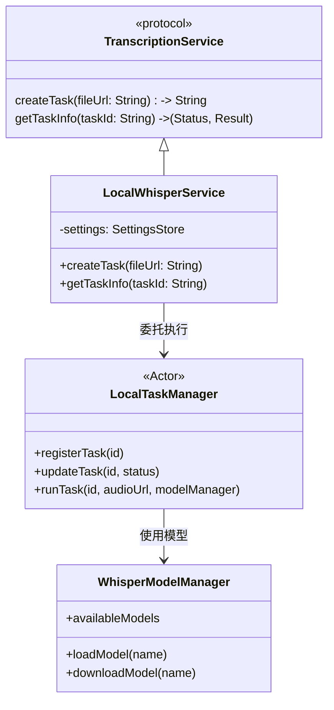

# 本地 Whisper 集成 (Local Whisper Integration)

## 概述 (Overview)

本文档详细介绍了将 **Local Whisper ASR** 集成到 VoiceMemo 应用程序中的方案。此功能允许用户通过 [WhisperKit](https://github.com/argmaxinc/WhisperKit) 库，利用设备的硬件（CPU/NPU）完全离线地执行语音转文字功能。此外，我们还将通过 [FluidAudio](https://github.com/FluidInference/FluidAudio) 集成本地说话人分离 (Speaker Diarization) 能力。

### 核心优势

1.  **隐私保护**：音频数据永远不会离开设备；无需上传到云服务器。
2.  **零成本**：没有 API 使用费或订阅费。
3.  **离线可用**：下载模型后，无需网络连接即可工作。
4.  **高性能**：针对 Apple Silicon (M系列芯片) 进行了 CoreML 优化。

## 架构 (Architecture)

该集成利用现有的 `TranscriptionService` 协议，无缝接入 `MeetingPipelineManager`。



### 组件

1.  **`LocalWhisperService`**: 实现 `TranscriptionService` 协议。它是流水线和本地推理引擎之间的桥梁。
2.  **`LocalTaskManager`**: 一个 Actor，用于管理异步本地任务的状态。由于本地推理不是 REST API，该 Actor 模拟“任务创建”和“状态轮询”，以保持与现有流水线架构的兼容性。
3.  **`WhisperModelManager`**: 管理 Whisper 模型的生命周期（下载、加载到内存、删除）。
4.  **`WhisperKit`**: 底层 ASR 引擎，运行转换为 CoreML 格式的 OpenAI Whisper 模型。
5.  **`FluidAudio`**: 底层说话人分离引擎，运行转换为 CoreML 格式的 Pyannote 模型。

## 流水线集成 (Pipeline Integration)

`MeetingPipelineManager` 负责流程编排。当 `Settings.asrProvider` 设置为 `.localWhisper` 时，流水线会自动适配：

### 云端流水线 (标准)
1.  **录音** -> `local.m4a`
2.  **上传原始音频** -> OSS (备份)
3.  **转码** -> `mixed.m4a`
4.  **上传混合音频** -> OSS
5.  **创建任务** -> 云端 API (听悟/火山)
6.  **轮询状态** -> 云端 API

### 本地流水线 (优化)
1.  **录音** -> `local.m4a`
2.  **上传原始音频** -> *跳过* (可选备份，目前跳过)
3.  **转码** -> *跳过* (WhisperKit 支持多种格式，或仅需最小化处理)
4.  **上传混合音频** -> *跳过* (文件在本地)
5.  **创建任务** -> `LocalWhisperService` (传递 `file://` URL)
6.  **轮询状态** -> `LocalTaskManager` (即时或内存检查)

## 实现细节 (Implementation Details)

### 依赖库

在 `Package.swift` 中添加 `WhisperKit` 和 `FluidAudio`：

```swift
dependencies: [
    .package(url: "https://github.com/argmaxinc/WhisperKit.git", from: "0.10.0"),
    .package(url: "https://github.com/FluidInference/FluidAudio.git", branch: "main") // 需确认最新 tag
]
```

### 服务工厂

在 `MeetingPipelineManager.swift` 中：

```swift
switch settings.asrProvider {
case .tingwu:
    self.transcriptionService = TingwuService(settings: settings)
case .volcengine:
    self.transcriptionService = VolcengineService(settings: settings)
case .localWhisper:
    self.transcriptionService = LocalWhisperService(settings: settings)
}
```

### 任务执行流程 (Result Fusion)

1.  `LocalWhisperService.createTask` 接收本地文件路径。
2.  它生成一个 UUID `taskId` 并将其注册到 `LocalTaskManager`，状态为 `.running`。
3.  它启动一个分离的 `Task` 来运行并行的推理工作：
    *   **Task A (ASR)**: 调用 `WhisperKit.transcribe(audioPath:)` 获取文本片段。
    *   **Task B (Diarization)**: 调用 `FluidAudio.diarize(audioPath:)` 获取说话人时间段。
4.  **结果融合 (Fusion)**:
    *   遍历每个文本片段 (Transcript Segment)。
    *   计算它与所有说话人时间段 (Speaker Segment) 的时间重叠 (Intersection over Union)。
    *   将重叠最大的说话人 ID 赋给该文本片段。
5.  完成后，更新 `LocalTaskManager` 状态为 `.success(result)`。
6.  主流水线轮询 `getTaskInfo` 并获取最终 JSON。

#### Result Fusion 算法细节

将 ASR 文本片段与说话人分离结果融合是关键步骤。以下是推荐的实现策略：

| 策略 | 描述 | 优点 | 缺点 |
|------|------|------|------|
| **IoU 匹配** | 计算文本片段与说话人片段的交并比，选择最大值 | 简单直观，适合大多数场景 | 对边界敏感，可能误判 |
| **动态窗口** | 以文本片段中心为基准，扩展固定时间窗口匹配 | 更鲁棒，减少边界误判 | 需要调整窗口大小 |
| **加权投票** | 综合多个说话人片段的权重进行投票 | 处理重叠说话人更准确 | 计算复杂度较高 |

**推荐实现：动态窗口匹配**

```swift
func assignSpeakerToTranscript(
    transcript: TranscriptSegment,
    speakers: [SpeakerSegment]
) -> String? {
    let windowStart = transcript.start
    let windowEnd = transcript.end
    
    let overlappingSpeakers = speakers.filter { speaker in
        speaker.start < windowEnd && speaker.end > windowStart
    }
    
    return overlappingSpeakers
        .map { ($0, min($0.end, windowEnd) - max($0.start, windowStart)) }
        .max(by: { $0.1 < $1.1 })?
        .0.speakerId
}
```

**边界情况处理**：
- **无重叠**：文本片段与任何说话人片段无重叠 → 标记为 "Unknown"
- **多说话人重叠**：多个说话人同时说话 → 选择重叠时间最长的说话人
- **静音片段**：文本片段位于说话人切换间隙 → 继承前一个说话人标签

### 音频预处理 (Audio Preprocessing)

WhisperKit 和 FluidAudio 对音频输入有特定要求。预处理确保最佳性能和准确性。

#### 音频要求

| 要求 | WhisperKit | FluidAudio | 处理方式 |
|------|------------|------------|----------|
| **采样率** | 16kHz | 16kHz | 重采样 |
| **声道数** | 单声道 | 单声道 | 混合为单声道 |
| **格式** | WAV/FLAC/M4A | WAV/FLAC | 转换为 WAV |
| **时长限制** | 无硬限制 | 建议 <30分钟 | 分块处理 |

#### 预处理流程

```swift
func preprocessAudio(_ url: URL) async throws -> URL {
    let audioFile = try AVAudioFile(forReading: url)
    
    guard audioFile.fileFormat.sampleRate == 16000 else {
        return try await resampleAudio(url, to: 16000)
    }
    
    guard audioFile.fileFormat.channelCount == 1 else {
        return try await convertToMono(url)
    }
    
    if audioFile.duration > 1800 {
        return try await chunkAudio(url, maxDuration: 1800)
    }
    
    return url
}
```

#### 长音频分块流程

```
长音频分块流程
═══════════════════════════════════════════════════════════════

输入：60分钟会议录音
         │
         ▼
┌─────────────────────────────────────────────────────────────┐
│ 分割为30分钟块，带5秒重叠                                    │
│                                                              │
│  块 1: 0:00 - 30:00  (重叠: 29:55 - 30:00)                  │
│  块 2: 29:55 - 59:55  (重叠: 59:50 - 59:55)                 │
│  块 3: 59:50 - 89:50  ...                                   │
└─────────────────────────────────────────────────────────────┘
         │
         ▼
┌─────────────────────────────────────────────────────────────┐
│ 并行处理块（受设备核心数限制）                                │
└─────────────────────────────────────────────────────────────┘
         │
         ▼
┌─────────────────────────────────────────────────────────────┐
│ 合并结果，去重重叠片段                                        │
└─────────────────────────────────────────────────────────────┘
```

#### 音频验证

推理前验证音频文件：

```swift
func validateAudioFile(_ url: URL) throws {
    let audioFile = try AVAudioFile(forReading: url)
    
    guard audioFile.length > 0 else {
        throw AudioValidationError.emptyFile
    }
    
    guard audioFile.fileFormat.sampleRate >= 8000 else {
        throw AudioValidationError.sampleRateTooLow
    }
    
    guard audioFile.duration < 7200 else {
        throw AudioValidationError.fileTooLong
    }
    
    guard !detectSilence(audioFile, threshold: 0.95) else {
        throw AudioValidationError.silentAudio
    }
}
```

### 任务取消和错误处理 (Task Cancellation and Error Handling)

#### 并行任务管理

由于 ASR 和 Diarization 并行运行，正确的取消传播至关重要：

```swift
func runParallelInference(audioPath: String) async throws -> Result {
    try await withThrowingTaskGroup(of: InferenceResult.self) { group in
        group.addTask {
            try await whisperKit.transcribe(audioPath: audioPath)
        }
        
        group.addTask {
            try await fluidAudio.diarize(audioPath: audioPath)
        }
        
        var asrResult: ASRResult?
        var diarizationResult: DiarizationResult?
        
        for try await result in group {
            switch result {
            case .asr(let r): asrResult = r
            case .diarization(let r): diarizationResult = r
            }
        }
        
        guard let asr = asrResult, let diar = diarizationResult else {
            throw InferenceError.partialFailure
        }
        
        return fuseResults(asr: asr, diarization: diar)
    }
}
```

**关键点**：
- `withThrowingTaskGroup` 确保如果一个任务失败，两个任务都会被取消
- 任务取消通过 Swift Concurrency 自动传播
- 任务组退出时释放内存

#### 错误场景和处理

| 场景 | 检测方式 | 处理策略 |
|------|----------|----------|
| **模型未下载** | `WhisperModelManager.loadModel()` 抛出异常 | 提示用户下载模型 |
| **内存不足** | 系统内存警告或 OOM 错误 | 释放缓存模型，使用更小模型重试 |
| **音频文件损坏** | 音频解码器抛出异常 | 推理前验证文件，显示用户友好错误 |
| **推理超时** | 任务超过时间限制（如30分钟） | 取消任务，建议分割音频 |
| **Diarization 失败，ASR 成功** | 收集到部分结果 | 返回不带说话人标签的转录 |
| **ASR 失败，Diarization 成功** | 收集到部分结果 | 返回错误（转录是主要输出） |
| **用户取消任务** | `Task.isCancelled` 检查 | 清理资源，更新 UI 状态 |

#### 取消流程

```
用户取消任务
        │
        ▼
┌───────────────────────┐
│ LocalTaskManager      │
│ 接收取消信号          │
└───────────┬───────────┘
            │
            ▼
┌───────────────────────┐
│ 在任务注册表中标记    │
│ 任务为 .cancelled     │
└───────────┬───────────┘
            │
            ▼
┌───────────────────────┐
│ 取消运行中的 Task     │
│ (Swift Concurrency)   │
└───────────┬───────────┘
            │
            ▼
┌───────────────────────┐
│ 释放模型内存          │
│ (如果没有其他任务)    │
└───────────┬───────────┘
            │
            ▼
┌───────────────────────┐
│ 清理临时文件          │
│ (预处理音频)          │
└───────────────────────┘
```

#### 内存压力处理

```swift
actor LocalTaskManager {
    private var activeTasks: [String: TaskHandle] = [:]
    
    func handleMemoryWarning() {
        let sortedTasks = activeTasks.sorted { $0.value.priority < $1.value.priority }
        
        for (taskId, handle) in sortedTasks {
            if shouldReleaseMemory() {
                handle.task.cancel()
                activeTasks.removeValue(forKey: taskId)
            }
        }
        
        WhisperModelManager.shared.releaseCachedModels()
    }
}
```

## 数据模型 (Data Model)

结果格式模仿其他提供商使用的 JSON 结构，以简化解析：

```json
{
  "provider": "localWhisper",
  "text": "完整转录文本...",
  "segments": [
    {
      "start": 0.0,
      "end": 2.5,
      "text": "Hello world",
      "speaker": "Speaker 0"
    }
  ]
}
```

`TranscriptParser.swift` 中的 `LocalWhisperParser` 处理此特定格式。

## 用户体验 (User Experience)

### 模型管理
用户在 **设置 > Local Inference** 中管理模型。
- **ASR Models**: Tiny, Base, Small, Medium, Large, Large-v2, Large-v3。
- **Diarization Models**: Pyannote 3.1 (CoreML Optimized)。
- **状态**: 未下载 (Not Downloaded), 下载中 (Downloading %), 已安装 (Installed)。
- **操作**: 一键下载或删除。

#### 模型生命周期管理 (Model Lifecycle Management)

高效的模型生命周期管理对于平衡性能和内存使用至关重要。

```
模型状态机
═══════════════════════════════════════════════════════════════

┌─────────────┐     ┌─────────────┐     ┌─────────────┐
│   Cold      │────▶│   Warm      │────▶│   Hot       │
│  (Unloaded) │     │  (Cached)   │     │  (In Use)   │
└─────────────┘     └─────────────┘     └─────────────┘
       │                    │                  │
       │                    │                  │
       ▼                    ▼                  ▼
   首次使用加载         保持5分钟缓存         任务执行中
   耗时 2-5s           快速复用             占用内存
   
内存压力处理：
• 收到内存警告时，从 Hot → Warm → Cold 逐级释放
• 提供用户设置：保持模型常驻 / 按需加载
```

#### 模型加载策略

```swift
actor WhisperModelManager {
    enum ModelState {
        case unloaded
        case cached(lastUsed: Date)
        case loaded(inUseCount: Int)
    }
    
    private var models: [String: ModelState] = [:]
    private let cacheTimeout: TimeInterval = 300 // 5 minutes
    
    func loadModel(_ name: String) async throws -> WhisperModel {
        switch models[name] {
        case .loaded(let count):
            models[name] = .loaded(inUseCount: count + 1)
            return getLoadedModel(name)
            
        case .cached:
            models[name] = .loaded(inUseCount: 1)
            return getLoadedModel(name)
            
        case .unloaded, .none:
            let model = try await loadModelFromDisk(name)
            models[name] = .loaded(inUseCount: 1)
            return model
        }
    }
    
    func releaseModel(_ name: String) {
        guard case .loaded(let count) = models[name], count > 1 else {
            models[name] = .cached(lastUsed: Date())
            return
        }
        models[name] = .loaded(inUseCount: count - 1)
    }
    
    func cleanupExpiredModels() {
        let now = Date()
        models = models.filter { _, state in
            guard case .cached(let lastUsed) = state else { return true }
            return now.timeIntervalSince(lastUsed) < cacheTimeout
        }
    }
}
```

#### 内存压力响应

```swift
class AppDelegate {
    func applicationDidReceiveMemoryWarning() {
        Task {
            await WhisperModelManager.shared.handleMemoryWarning()
        }
    }
}

extension WhisperModelManager {
    func handleMemoryWarning() async {
        let sortedModels = models.sorted { lhs, rhs in
            let lhsPriority = getPriority(lhs.key)
            let rhsPriority = getPriority(rhs.key)
            return lhsPriority < rhsPriority
        }
        
        for (name, state) in sortedModels {
            if shouldReleaseMemory() {
                await unloadModel(name)
            }
        }
    }
    
    private func getPriority(_ modelName: String) -> Int {
        switch modelName {
        case let s where s.contains("tiny"): return 1
        case let s where s.contains("base"): return 2
        case let s where s.contains("small"): return 3
        case let s where s.contains("medium"): return 4
        case let s where s.contains("large"): return 5
        default: return 0
        }
    }
}
```

#### 用户模型行为设置

| 设置 | 描述 | 默认值 |
|------|------|--------|
| **保持模型在内存中** | 缓存已加载的模型以加快后续任务 | 开启 |
| **自动下载缺失模型** | 开始任务时自动下载 | 关闭 |
| **首选模型大小** | 新任务的默认模型 | Base |
| **内存限制** | 模型缓存的最大内存 | 2GB |

### 流式结果返回 (Streaming Results)

当前实现在完整推理后才返回结果。流式返回通过实时显示进度提供更好的用户体验。

#### 流式架构

```swift
protocol StreamingTranscriptionDelegate: AnyObject {
    func didReceivePartialTranscript(_ segment: TranscriptSegment)
    func didReceiveSpeakerUpdate(_ speaker: SpeakerSegment)
    func didCompleteFusion(_ finalResult: Result)
    func didUpdateProgress(_ progress: Double)
}

class LocalWhisperService {
    weak var delegate: StreamingTranscriptionDelegate?
    
    func runStreamingInference(audioPath: String) async throws {
        let progress = TaskProgress()
        
        async let asrTask = runASRWithProgress(audioPath, progress: progress)
        async let diarizationTask = runDiarizationWithProgress(audioPath, progress: progress)
        
        for await event in mergeStreams(asrTask, diarizationTask) {
            switch event {
            case .partialTranscript(let segment):
                delegate?.didReceivePartialTranscript(segment)
            case .speakerUpdate(let speaker):
                delegate?.didReceiveSpeakerUpdate(speaker)
            case .progress(let value):
                delegate?.didUpdateProgress(value)
            case .complete(let result):
                delegate?.didCompleteFusion(result)
            }
        }
    }
}
```

#### 进度计算

```
进度计算
═══════════════════════════════════════════════════════════════

总进度 = (ASR 进度 × 0.6) + (Diarization 进度 × 0.4)

ASR 进度：
  • 加载模型: 0-10%
  • 预处理音频: 10-20%
  • 推理（每块）: 20-90%
  • 后处理: 90-100%

Diarization 进度：
  • 加载模型: 0-15%
  • 推理: 15-95%
  • 后处理: 95-100%
```

#### UI 注意事项

- 使用 `LazyVStack` 渲染流式转录片段以避免 UI 冻结
- 显示进度条和预计剩余时间
- 允许用户暂停/恢复流式传输
- 用动画高亮新添加的片段

### 调试和诊断 (Debugging and Diagnostics)

本地推理比云 API 更难调试。本节提供故障排除的工具和指南。

#### 调试选项

```swift
struct LocalInferenceDebugOptions {
    var saveIntermediateAudio: Bool = false
    var logModelInferenceTime: Bool = true
    var exportRawResults: Bool = false
    var verboseLogging: Bool = false
    var captureMemorySnapshots: Bool = false
}

class LocalWhisperService {
    private let debugOptions: LocalInferenceDebugOptions
    
    func runInference(audioPath: String) async throws -> Result {
        let startTime = Date()
        
        if debugOptions.saveIntermediateAudio {
            let preprocessedPath = try await preprocessAndSave(audioPath)
            logDebug("Preprocessed audio saved to: \(preprocessedPath)")
        }
        
        if debugOptions.logModelInferenceTime {
            let modelLoadStart = Date()
            let model = try await modelManager.loadModel(settings.selectedModel)
            logDebug("Model load time: \(Date().timeIntervalSince(modelLoadStart))s")
        }
        
        let result = try await performInference(audioPath)
        
        if debugOptions.exportRawResults {
            try exportRawResults(result, to: "debug_raw_results.json")
        }
        
        let totalTime = Date().timeIntervalSince(startTime)
        logDebug("Total inference time: \(totalTime)s")
        
        return result
    }
}
```

#### 常见问题和解决方案

| 问题 | 症状 | 诊断 | 解决方案 |
|------|------|------|----------|
| **模型无法加载** | "Model not found" 错误 | 检查模型下载状态 | 在设置中下载模型 |
| **内存不足** | 推理期间应用崩溃 | 在 Instruments 中检查内存使用 | 使用更小模型或启用分块 |
| **转录准确性差** | 转录中有许多错误 | 检查音频质量和采样率 | 重采样到 16kHz，使用更大模型 |
| **说话人混淆** | 错误的说话人标签 | 检查分离模型状态 | 确保分离模型已下载 |
| **推理缓慢** | 耗时 >10x 实时时间 | 检查设备能力 | 使用量化模型或更小模型 |
| **静音音频** | 空转录 | 推理前验证音频 | 检查麦克风和录音 |

#### 诊断命令

```bash
# 检查可用模型
ls -lh ~/Library/Application\ Support/VoiceMemo/Models/

# 检查模型文件完整性
file ~/Library/Application\ Support/VoiceMemo/Models/whisper-base.mlmodelc

# 监控推理期间的内存使用
instruments -t "Memory" -D trace.trace

# 导出调试日志
log show --predicate 'process == "VoiceMemo"' --last 1h > debug.log
```

#### 性能基准

Apple Silicon 上的参考性能（近似值）：

| 设备 | 模型 | 1分钟音频 | 10分钟音频 |
|------|------|-----------|------------|
| M1 Air | Base | ~5s | ~45s |
| M1 Air | Large-v3 | ~20s | ~180s |
| M2 Pro | Base | ~3s | ~25s |
| M2 Pro | Large-v3 | ~12s | ~110s |
| M3 Max | Base | ~2s | ~18s |
| M3 Max | Large-v3 | ~8s | ~75s |

注意：时间包括 ASR + Diarization + Fusion。

### 容错 (Fallback)
如果用户选择了 "Local Whisper" 但尚未下载模型：
- 服务会尝试加载所选模型。
- 如果缺失，`WhisperModelManager` 将抛出错误或尝试自动下载（取决于配置）。理想情况下，UI 应在模型未准备好时阻止开始任务。

## 未来改进 (Future Improvements)

- **量化 (Quantization)**：允许用户选择量化版本（Int8）以降低内存占用。
- **VAD 优化**：使用 Silero VAD 进一步提高静音检测的准确性。
