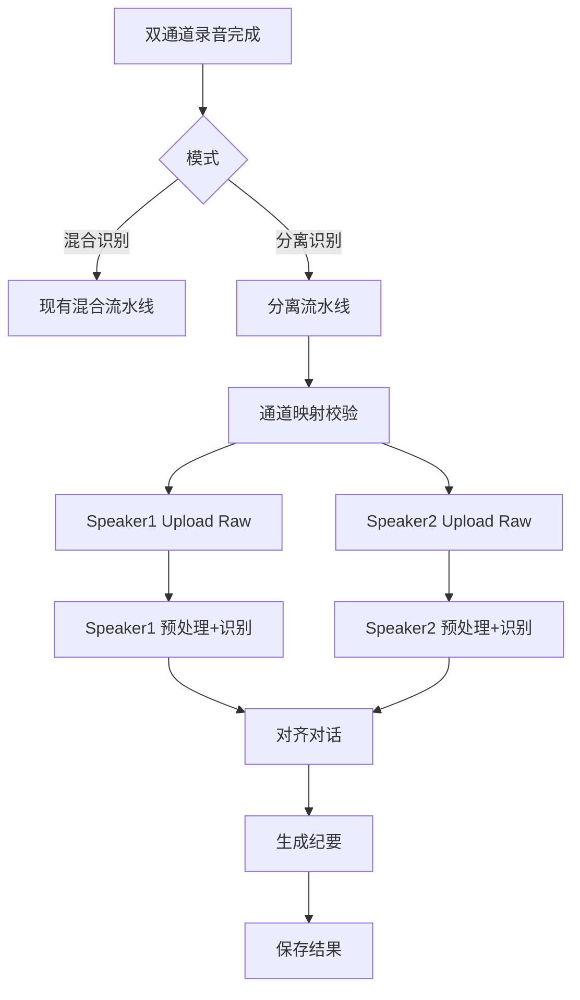

# 双人分离识别模式技术方案

## 文档目的

- 在现有混合识别之外，新增“分离识别模式”，构建独立流水线，形成可执行实施方案。
- 明确输入条件、输出优先级、摘要策略、失败策略与存储模型，保证可落地。

## 范围 / 非目标

- 范围：双通道系统录音双轨输入；用户手动指定通道映射；基于采样帧时间戳；允许重叠片段标注；单路失败输出部分；纪要区分 speaker 行动项并保留单路纪要备份。
- 非目标：不做说话人分离（单通道），保持混合模式兼容并在同一流水线内分支处理。

## 术语表

- 混合识别：当前流程，对混合音频进行单路识别。
- 分离识别：双通道输入，按通道分别识别并对齐。
- 对齐对话：将双路识别结果映射到统一时间轴的视图。
- 部分完成：双路之一失败但仍产出可用结果的状态。

## 高层流程

## 关键需求约束（当前实现）

- 输入：系统录音双轨，强制双通道。
- 通道映射（当前实现）：speaker1=麦克风（本地），speaker2=系统音频（远端）。
- 对齐与纪要：暂未做时间轴对齐与按 speaker 的纪要拆分；当前仅保证双路原始转写产出并在 UI 合并展示。
- 失败策略：双路任一路失败时保留已完成路的结果，并支持按 speaker 重试。

## 输出优先级与降级策略（规划）

### 输出层级

1. 原始双路转写（当前基础输出）
2. 对齐对话视图（规划增强输出）
3. 会议纪要（规划智能输出）

### 优先级规则

- 任何情况下优先保证原始转写产出。
- 当前版本仅保证原始转写与合并展示；对齐与纪要相关规则作为后续实现目标保留。

## 核心类型与职责（映射到文件/类）

### 现有相关入口

- 录音与混合输出：`Sources/VoiceMemo/AudioRecorder.swift`
- 混合流水线：`Sources/VoiceMemo/Services/MeetingPipelineManager.swift`
- 任务模型：`Sources/VoiceMemo/Models/MeetingTask.swift`
- 设置与特性开关：`Sources/VoiceMemo/Services/SettingsStore.swift`
- 结果展示与导出：`Sources/VoiceMemo/Views/ResultView.swift`

### 当前实现（已落地）

- 模式枚举：`MeetingMode`（`mixed` / `separated`）
- 分离模式流水线：`MeetingPipelineManager` 内按 `task.mode` 分支执行双路处理
- 结果字段：`MeetingTask` 已包含 speaker1/2 音频路径、转写、状态、失败 step 字段；`alignedConversation` 仍为预留字段

## 数据模型与存储

### MeetingTask 字段（分离模式相关）

- `mode`
- `speaker1AudioPath` / `speaker2AudioPath`
- `ossUrl` / `speaker2OssUrl`
- `tingwuTaskId` / `speaker2TingwuTaskId`
- `speaker1Transcript` / `speaker2Transcript`
- `speaker1Status` / `speaker2Status`
- `speaker1FailedStep` / `speaker2FailedStep`
- `alignedConversation`

### 存储层变更点（SQLiteStorage/MySQLStorage）

- 新增字段列，存储分离模式结果与状态标记。
- 保持混合模式字段不变。

## 分离流水线详细步骤

1. 输入校验
   - 双通道文件存在、时长有效。
   - 通道映射为固定策略，无需额外配置。

2. 分路识别
   - speaker1 与 speaker2 两条 pipeline 并行执行（每路独立跑 Upload Raw → Transcode → Upload (Mixed) → CreateTask → Poll）。

3. 结果落地
   - 单路成功立即写入对应 transcript。
   - 单路失败标记 `speakerXStatus = failed`。
   - 额外写入 `speakerXFailedStep` 便于按 speaker 精准重试。

4. 合并展示（当前实现）
   - 仅当任一路成功时合并展示。
   - 当前仅将两路 transcript 按 speaker 标题拼接写入 `task.transcript`。
   - `alignedConversation` 暂不填充，保留给后续时间轴对齐实现。

5. 纪要（当前实现）
   - 分离模式暂不生成 `summary` / `keyPoints` / `actionItems`（这些能力仍主要在混合模式中使用）。

## 错误处理

- 任一路失败时，会写入 `task.lastError`，并将全局 `task.status` 标记为 `failed`。
- 已成功路的转写结果会保留在 `speakerXTranscript` 中，可用于“部分完成”的展示与导出。
- UI 会展示每路 speaker 的状态与失败 step，并支持按 speaker 重试。

## 安全与隐私注意事项

- 不记录真实 AK 信息，沿用 `SettingsStore` 与 `KeychainHelper` 现有策略。
- 分离模式日志不可包含用户敏感内容，仅记录状态与耗时。

## 运行与配置说明

- 仅当双通道输入可用时允许选择分离模式。
- 当前通道映射为固定策略，无需额外配置入口。

## 验证方式（不写代码的验收清单）

- 创建任务时能选择混合/分离模式。
- 分离模式仅在双通道录音完成后可选。
- 分离模式下双路识别结果落地，且对齐结果存在。
- 单路失败时仍有单路结果与提示信息。
- 纪要中行动项按 speaker 分组。

## 待确认事项

- UI 中通道映射的具体交互位置（录制前/录制后）。
- speaker 命名规则是否固定或允许用户自定义。
- 重叠片段在结果视图中的展示样式（并排/叠加）。
