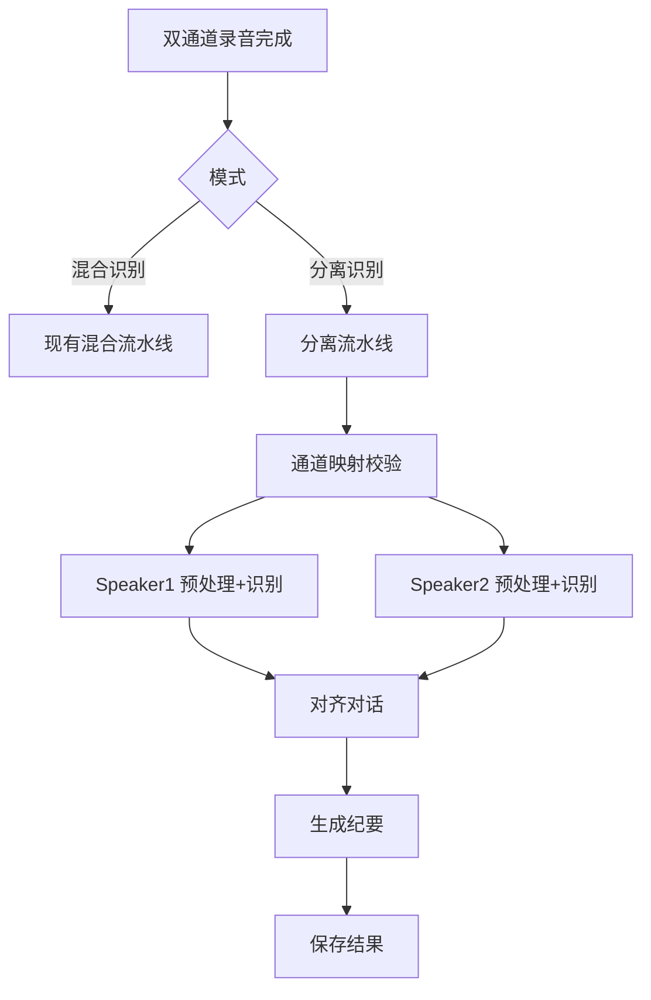

# 双人分离识别模式技术方案

## 文档目的

- 在现有混合识别之外，新增“分离识别模式”，构建独立流水线，形成可执行实施方案。
- 明确输入条件、输出优先级、摘要策略、失败策略与存储模型，保证可落地。

## 范围 / 非目标

- 范围：双通道系统录音双轨输入；用户手动指定通道映射；基于采样帧时间戳；允许重叠片段标注；单路失败输出部分；纪要区分 speaker 行动项并保留单路纪要备份。
- 非目标：不做说话人分离（单通道），不对现有混合流水线做复用或合并。

## 术语表

- 混合识别：当前流程，对混合音频进行单路识别。
- 分离识别：双通道输入，按通道分别识别并对齐。
- 对齐对话：将双路识别结果映射到统一时间轴的视图。
- 部分完成：双路之一失败但仍产出可用结果的状态。

## 高层流程

## 关键需求约束（已确认）

- 输入：系统录音双轨，强制双通道。
- 通道映射：用户手动指定 speaker1/speaker2。
- 时间基准：采样帧时间戳。
- 对齐策略：允许同时间段冲突并标注重叠。
- 摘要策略：区分 speaker 的行动项；保留单路纪要备份。
- 失败策略：双路某一路失败时输出部分。
- 版本/流水线标识：需要。

## 输出优先级与降级策略

### 输出层级

1. 原始双路转写（基础输出）
2. 对齐对话视图（增强输出）
3. 会议纪要（智能输出）

### 优先级规则

- 任何情况下优先保证原始转写产出。
- 对齐视图允许降级为单路时间线并标注 incomplete。
- 纪要允许降级为单路纪要，并标注来源。

## 核心类型与职责（映射到文件/类）

### 现有相关入口

- 录音与混合输出：`Sources/VoiceMemo/AudioRecorder.swift`
- 混合流水线：`Sources/VoiceMemo/Services/MeetingPipelineManager.swift`
- 任务模型：`Sources/VoiceMemo/Models/MeetingTask.swift`
- 设置与特性开关：`Sources/VoiceMemo/Services/SettingsStore.swift`
- 结果展示与导出：`Sources/VoiceMemo/Views/ResultView.swift`

### 新增/扩展建议（不复用流水线）

- 新增模式枚举：`MeetingTaskRecognitionMode`
  - `mixed`
  - `separated`
- 新增分离流水线管理器：`SeparatedMeetingPipelineManager`
  - 仅用于分离模式任务
  - 不依赖 `MeetingPipelineManager` 的任何逻辑复用
- 新增对齐模块：`ConversationAligner`
  - 输入：双路分段结果 + 采样帧时间戳
  - 输出：统一时间轴的对话片段与重叠标记
- 新增纪要模块：`SeparatedSummaryBuilder`
  - 输入：对齐对话
  - 输出：区分 speaker 的行动项与共同结论
- 新增输出模型：`SeparatedRecognitionResult`
  - `speaker1Transcript`
  - `speaker2Transcript`
  - `alignedConversation`
  - `summary`
  - `summaryBySpeaker`
  - `summaryFallback`
  - `completionStatus`
  - `speaker1Status`
  - `speaker2Status`
  - `pipelineId`
  - `pipelineVersion`

## 数据模型与存储

### MeetingTask 扩展建议

- `recognitionMode`
- `pipelineId`
- `pipelineVersion`
- `channelMapping`
- `completionStatus`
- `speaker1Status`
- `speaker2Status`
- `separatedTranscriptSpeaker1`
- `separatedTranscriptSpeaker2`
- `alignedConversation`
- `summaryBySpeaker`
- `summaryFallback`

### DatabaseManager 变更点

- 新增字段列，存储分离模式结果与状态标记。
- 保持混合模式字段不变。

## 分离流水线详细步骤

1. 输入校验
   - 双通道文件存在、时长有效。
   - 用户已完成通道映射。

2. 分路识别
   - 以采样帧时间为基准生成时间戳。
   - speaker1 与 speaker2 两条 pipeline 并行执行。

3. 结果落地
   - 单路成功立即写入对应 transcript。
   - 单路失败标记 `speakerXStatus = failed`。

4. 对齐
   - 仅当任一路成功时尝试对齐。
   - 冲突片段标记 `overlap = true`。
   - 仅单路成功时生成单路时间线。

5. 纪要
   - 优先使用对齐对话。
   - 单路降级生成 `summaryFallback`。
   - 行动项必须区分 speaker。

## 错误处理

- 任何失败均写入 `completionStatus`：
  - `complete`：双路成功
  - `partial`：单路成功
  - `failed`：双路失败
- UI 显示“仅一路成功”提示，依据 `completionStatus`。

## 安全与隐私注意事项

- 不记录真实 AK 信息，沿用 `SettingsStore` 与 `KeychainHelper` 现有策略。
- 分离模式日志不可包含用户敏感内容，仅记录状态与耗时。

## 运行与配置说明

- 新增设置项：识别模式选择与通道映射入口。
- 仅当双通道输入可用时允许选择分离模式。
- 新增流水线版本号，用于结果兼容与回放解释。

## 验证方式（不写代码的验收清单）

- 创建任务时能选择混合/分离模式。
- 分离模式仅在双通道录音完成后可选。
- 分离模式下双路识别结果落地，且对齐结果存在。
- 单路失败时仍有单路结果与提示信息。
- 纪要中行动项按 speaker 分组。

## 待确认事项

- UI 中通道映射的具体交互位置（录制前/录制后）。
- speaker 命名规则是否固定或允许用户自定义。
- 重叠片段在结果视图中的展示样式（并排/叠加）。
